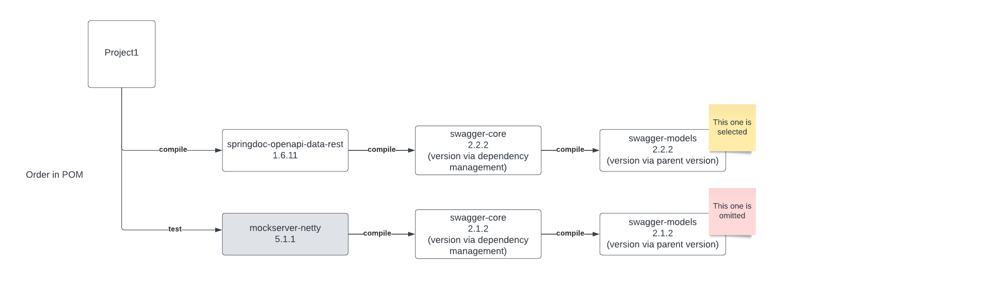
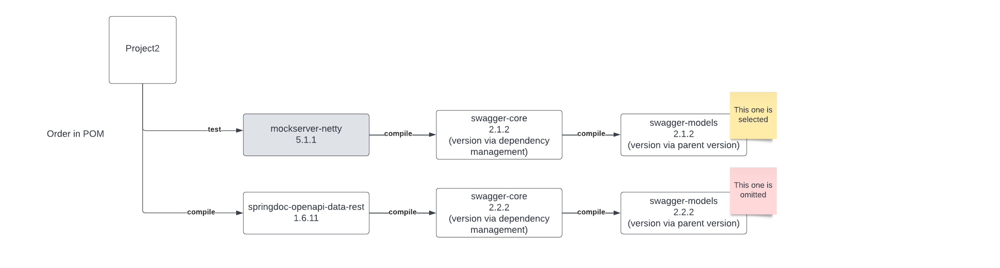
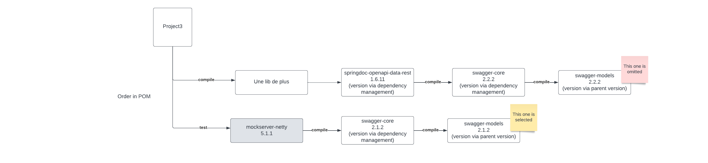
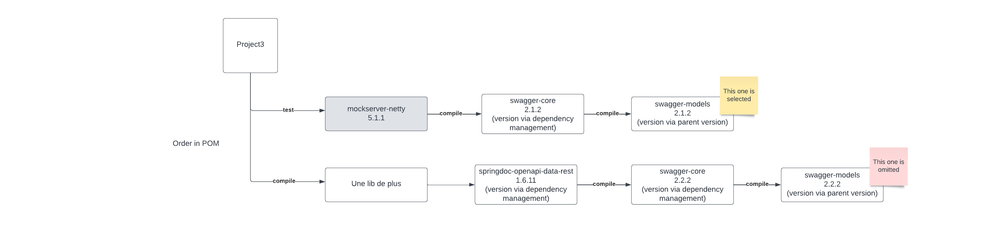

# Strange behavior of dependencies versions in Maven

## Story
Un jour un de mes Tech Lead est confronté à une exception ``MethodNotFoundException`` sur une méthode d'une librairie.  

1️⃣ La librairie en question est ``swagger-models``.  
2️⃣ La méthode existe dans la version 2.2.2 de la librairie.  
3️⃣ La méthode n'existe pas dans la version 2.1.2 de la librairie.  

Le projet du Tech Lead ne tire pas cette dépendance directement mais via plusieurs chemins d'autres dépendances.  

## Le POC
Le POC reproduit le problème et investigue plusieurs scenarios.  
Il y a 4 projets dans le POC représentant 4 scénarios.  

### projet1
Projet de référence


### projet2
Projet identique au projet 1, mais les dépendances de test sont déclarées AVANT


### projet3
Projet identique au projet 1, mais il y a un étage de plus dans le chemin de dépendances


### projet4
Projet identique au projet 2, mais il y a un étage de plus dans le chemin de dépendances


## Analyses via mvn dependency tree et build-calsspath en mode verbose et scope runtime
La commande ```mvn dependency:tree -Dverbose -Dincludes=io.swagger.core.v3:swagger-models  -Dscope=runtime``` est utilisée pour
comprendre le chemin de dépendance et la selection finale de maven.  

La commande ```mvn dependency:build-classpath -DincludeScope=runtime``` est utilisée pour voir la liste exacte de dépendances qui seront 
nécessaires pour lancer le projet.

### Résultats projet 1
```
./show-dependencies.sh project1                                                                                                                                              ✔ 
[INFO] Scanning for projects...
[INFO] 
[INFO] ----------------------------< poc:project1 >----------------------------
[INFO] Building project1 1.0
[INFO] --------------------------------[ jar ]---------------------------------
[INFO] 
[INFO] --- maven-dependency-plugin:2.8:tree (default-cli) @ project1 ---
[WARNING] The artifact xml-apis:xml-apis:jar:2.0.2 has been relocated to xml-apis:xml-apis:jar:1.0.b2
[INFO] poc:project1:jar:1.0
[INFO] +- org.springdoc:springdoc-openapi-data-rest:jar:1.6.11:compile
[INFO] |  \- org.springdoc:springdoc-openapi-hateoas:jar:1.6.11:compile
[INFO] |     \- org.springdoc:springdoc-openapi-common:jar:1.6.11:compile
[INFO] |        \- io.swagger.core.v3:swagger-core:jar:2.2.2:compile
[INFO] |           \- io.swagger.core.v3:swagger-models:jar:2.2.2:compile
[INFO] \- org.mock-server:mockserver-netty:jar:5.11.1:test
[INFO]    \- org.mock-server:mockserver-core:jar:5.11.1:test
[INFO]       \- io.swagger.parser.v3:swagger-parser:jar:2.0.20:test
[INFO]          +- io.swagger.parser.v3:swagger-parser-v2-converter:jar:2.0.20:test
[INFO]          |  +- (io.swagger.core.v3:swagger-models:jar:2.1.2:test - omitted for conflict with 2.2.2)
[INFO]          |  \- io.swagger.parser.v3:swagger-parser-core:jar:2.0.20:test
[INFO]          |     \- (io.swagger.core.v3:swagger-models:jar:2.1.2:test - omitted for conflict with 2.2.2)
[INFO]          \- io.swagger.parser.v3:swagger-parser-v3:jar:2.0.20:test
[INFO]             \- (io.swagger.core.v3:swagger-models:jar:2.1.2:test - omitted for conflict with 2.2.2)
[INFO] ------------------------------------------------------------------------
[INFO] BUILD SUCCESS
[INFO] ------------------------------------------------------------------------
[INFO] Total time:  1.696 s
[INFO] Finished at: 2023-09-13T10:32:55+02:00
[INFO] ------------------------------------------------------------------------
```

```
./search-version.sh project1                                                                                                                                                 ✔ 
swagger-models/2.2.2/
```
 
La version qui se trouve dans le classpath de runtime est la 2.2.2

### Résultats projet 2
```
./show-dependencies.sh project2                                                                                                                                    SIGINT(2) ↵ 
[INFO] Scanning for projects...
[INFO] 
[INFO] ----------------------------< poc:project2 >----------------------------
[INFO] Building project2 1.0
[INFO] --------------------------------[ jar ]---------------------------------
[INFO] 
[INFO] --- maven-dependency-plugin:2.8:tree (default-cli) @ project2 ---
[WARNING] The artifact xml-apis:xml-apis:jar:2.0.2 has been relocated to xml-apis:xml-apis:jar:1.0.b2
[INFO] poc:project2:jar:1.0
[INFO] +- org.mock-server:mockserver-netty:jar:5.11.1:test
[INFO] |  \- org.mock-server:mockserver-core:jar:5.11.1:test
[INFO] |     \- io.swagger.parser.v3:swagger-parser:jar:2.0.20:test
[INFO] |        +- io.swagger.parser.v3:swagger-parser-v2-converter:jar:2.0.20:test
[INFO] |        |  +- (io.swagger.core.v3:swagger-models:jar:2.1.2:compile - scope updated from test; omitted for duplicate)
[INFO] |        |  \- io.swagger.parser.v3:swagger-parser-core:jar:2.0.20:test
[INFO] |        |     \- (io.swagger.core.v3:swagger-models:jar:2.1.2:test - omitted for duplicate)
[INFO] |        \- io.swagger.parser.v3:swagger-parser-v3:jar:2.0.20:test
[INFO] |           \- (io.swagger.core.v3:swagger-models:jar:2.1.2:test - omitted for duplicate)
[INFO] \- org.springdoc:springdoc-openapi-data-rest:jar:1.6.11:compile
[INFO]    \- org.springdoc:springdoc-openapi-hateoas:jar:1.6.11:compile
[INFO]       \- org.springdoc:springdoc-openapi-common:jar:1.6.11:compile
[INFO]          \- io.swagger.core.v3:swagger-core:jar:2.2.2:compile
[INFO]             \- io.swagger.core.v3:swagger-models:jar:2.1.2:compile
[INFO] ------------------------------------------------------------------------
[INFO] BUILD SUCCESS
[INFO] ------------------------------------------------------------------------
```

```
 ./search-version.sh project2                                                                                                                                                 ✔ 
swagger-models/2.1.2/
```
La version qui se trouve dans le classpath de runtime est la 2.1.2 ❌❌❌
La version tirée par la dépendance de test pollue la version de prod.


### Résultats projet 3
```
 ./show-dependencies.sh project3                                                                                                                                              ✔ 
[INFO] Scanning for projects...
[INFO] 
[INFO] ----------------------------< poc:project3 >----------------------------
[INFO] Building project3 1.0
[INFO] --------------------------------[ jar ]---------------------------------
[INFO] 
[INFO] --- maven-dependency-plugin:2.8:tree (default-cli) @ project3 ---
[WARNING] The artifact xml-apis:xml-apis:jar:2.0.2 has been relocated to xml-apis:xml-apis:jar:1.0.b2
[INFO] poc:project3:jar:1.0
[INFO] +- poc:library1:jar:1.0:compile
[INFO] |  \- org.springdoc:springdoc-openapi-data-rest:jar:1.6.11:compile
[INFO] |     \- org.springdoc:springdoc-openapi-hateoas:jar:1.6.11:compile
[INFO] |        \- org.springdoc:springdoc-openapi-common:jar:1.6.11:compile
[INFO] |           \- io.swagger.core.v3:swagger-core:jar:2.2.2:compile
[INFO] |              \- io.swagger.core.v3:swagger-models:jar:2.1.2:compile
[INFO] \- org.mock-server:mockserver-netty:jar:5.11.1:test
[INFO]    \- org.mock-server:mockserver-core:jar:5.11.1:test
[INFO]       \- io.swagger.parser.v3:swagger-parser:jar:2.0.20:test
[INFO]          +- io.swagger.parser.v3:swagger-parser-v2-converter:jar:2.0.20:test
[INFO]          |  +- (io.swagger.core.v3:swagger-models:jar:2.1.2:compile - scope updated from test; omitted for duplicate)
[INFO]          |  \- io.swagger.parser.v3:swagger-parser-core:jar:2.0.20:test
[INFO]          |     \- (io.swagger.core.v3:swagger-models:jar:2.1.2:test - omitted for duplicate)
[INFO]          \- io.swagger.parser.v3:swagger-parser-v3:jar:2.0.20:test
[INFO]             \- (io.swagger.core.v3:swagger-models:jar:2.1.2:compile - scope updated from test; omitted for duplicate)
[INFO] ------------------------------------------------------------------------
[INFO] BUILD SUCCESS
[INFO] ------------------------------------------------------------------------
```

```
./search-version.sh project3                                                                                                                                                 ✔ 
swagger-models/2.1.2/
```

La version qui se trouve dans le classpath de runtime est la 2.1.2 ❌❌❌
La version tirée par la dépendance de test pollue la version de prod.  
BIEN QUE LA DEPENDENCE DE PROD SOIT AVANT !!!

### Résultats projet 4

```
./show-dependencies.sh project4                                                                                                                                              ✔ 
[INFO] Scanning for projects...
[INFO] 
[INFO] ----------------------------< poc:project4 >----------------------------
[INFO] Building project4 1.0
[INFO] --------------------------------[ jar ]---------------------------------
[INFO] 
[INFO] --- maven-dependency-plugin:2.8:tree (default-cli) @ project4 ---
[WARNING] The artifact xml-apis:xml-apis:jar:2.0.2 has been relocated to xml-apis:xml-apis:jar:1.0.b2
[INFO] poc:project4:jar:1.0
[INFO] +- org.mock-server:mockserver-netty:jar:5.11.1:test
[INFO] |  \- org.mock-server:mockserver-core:jar:5.11.1:test
[INFO] |     \- io.swagger.parser.v3:swagger-parser:jar:2.0.20:test
[INFO] |        +- io.swagger.parser.v3:swagger-parser-v2-converter:jar:2.0.20:test
[INFO] |        |  +- (io.swagger.core.v3:swagger-models:jar:2.1.2:compile - scope updated from test; omitted for duplicate)
[INFO] |        |  \- io.swagger.parser.v3:swagger-parser-core:jar:2.0.20:test
[INFO] |        |     \- (io.swagger.core.v3:swagger-models:jar:2.1.2:test - omitted for duplicate)
[INFO] |        \- io.swagger.parser.v3:swagger-parser-v3:jar:2.0.20:test
[INFO] |           \- (io.swagger.core.v3:swagger-models:jar:2.1.2:test - omitted for duplicate)
[INFO] \- poc:library1:jar:1.0:compile
[INFO]    \- org.springdoc:springdoc-openapi-data-rest:jar:1.6.11:compile
[INFO]       \- org.springdoc:springdoc-openapi-hateoas:jar:1.6.11:compile
[INFO]          \- org.springdoc:springdoc-openapi-common:jar:1.6.11:compile
[INFO]             \- io.swagger.core.v3:swagger-core:jar:2.1.2:compile
[INFO]                \- io.swagger.core.v3:swagger-models:jar:2.1.2:compile
[INFO] ------------------------------------------------------------------------
[INFO] BUILD SUCCESS
[INFO] ------------------------------------------------------------------------
```

```
./search-version.sh project4                                                                                                                                                 ✔ 
swagger-models/2.1.2/
```

La version qui se trouve dans le classpath de runtime est la 2.1.2 ❌❌❌
La version tirée par la dépendance de test pollue la version de prod.  


## Analyse

Il semble que la version des librairies est prise (les conflits sont résolus):
- 1️⃣ AVANT que le scope Compile/Runtime/Test ne soit appliqué
- 2️⃣ La dépendance la plus "proche" en terme de profondeur d'arbre GAGNE
- 3️⃣En cas d'égalité (même profondeur d'arbre), la PREMIERE dans le pom.xml GAGNE

Concernant les règles 2 et 3, la doc de maven est assez explicite:
https://maven.apache.org/guides/introduction/introduction-to-dependency-mechanism.html


